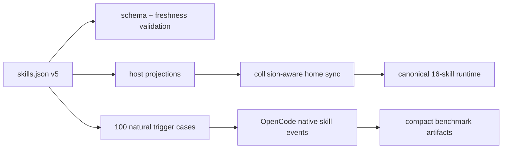

# 2026-07 Agent Skill Portfolio Audit

Status: accepted implementation baseline  
Scope: canonical `~/.agents/skills` portfolio and its Codex, Cursor, OpenCode, Claude, and Antigravity projections  
Decision date: 2026-07-11

## Executive decision

The portfolio remains useful, but only for capabilities that provide at least one of these advantages:

1. host- or tool-specific operation;
2. volatile domain knowledge that is easy to answer incorrectly;
3. a repeatable workflow with observable verification;
4. a boundary that prevents a high-cost routing mistake.

The active core therefore contracts from 19 to 16 skills. General planning, generic Bun scripting policy, and presentation production leave automatic discovery. The local meta-skill becomes `skill-portfolio-maintainer` so it no longer collides with Codex's system `skill-creator`.

Modern frontier models reduce the value of procedural scaffolding. OpenAI recommends leaner prompts and relying on stronger intent understanding; Anthropic warns that older, overly prescriptive skills can reduce quality. GLM and Grok also emphasize long-horizon agent execution. Skills still matter because Codex, Cursor, and OpenCode progressively discover them through compact name-and-description metadata. The portfolio should therefore keep routing and non-obvious constraints, not re-teach general software practice.

## Accepted target

- 16 active core skills.
- `skill-creator` renamed to `skill-portfolio-maintainer`.
- `brainstorming`, `bun-ts-scripting-policy`, and `ppt-generation` archived.
- Presentation-specific `image-generation` archived with `ppt-generation`.
- Native host planning and presentation capabilities take precedence.
- OpenCode trigger acceptance uses `opencode/nemotron-3-ultra-free`; `opencode/north-mini-code-free` covers boundary smoke.
- Home-level projection cleanup is allowed only through collision-aware backup-and-apply behavior.
- Implementation is delivered as seven independently validated commits.

## Model and host implications

| Surface | Design implication | Portfolio response |
| --- | --- | --- |
| GPT-5.6 / Codex | Strong intent inference; lean prompts; native planning, browsing, document, and presentation surfaces | Remove repeated scaffolding and do not intercept native capabilities |
| Claude Fable 5 | Over-prescriptive legacy skills can degrade output | Keep constraints and failure modes only; archive generic gates |
| GLM-5.2 | Long-running agentic execution with broad tool use | Prefer outcome checks over scripted answer formats |
| Grok 4.5 | High autonomy with less task specification | Test natural user prompts and actual tool events |
| Cursor | Native Agent Skills discovery | Project the canonical portfolio without a second content copy |
| OpenCode 1.17 | Native skill discovery and permissions; config precedence matters | Benchmark with isolated config and parse `skill` tool events |

## Runtime collision baseline

The pre-change runtime has four collision classes that must be handled without deleting unrelated personal configuration:

- Codex has a separate `react-component-designer` copy and a system `skill-creator` whose name collides with the local meta-skill.
- OpenCode has an older `java-pro` copy and archived skill shadows under `~/.config/opencode/skills`.
- Claude contains broken or backup links for older repo-owned skills.
- OpenCode's personal `opencode.json` is a real file with providers, credentials, plugins, and model choices; it must be merged, never replaced by a symlink.

Non-repo custom skills such as `hook-best-practices` and `user-global-rules` are explicitly out of scope.

## Acceptance architecture

Routing success is measured from the first actual `skill` tool event, never from a requested answer token such as `Selected:`. Outcome suites measure domain decisions, commands, artifacts, and safety boundaries. Raw transcripts and staged trees are disposable.

## Review cadence

- `fast`: 60 days for rapidly changing tool/API lanes.
- `release-driven`: 120 days for platform and framework release lanes.
- `stable`: 365 days for durable design and workflow boundaries.

An expired review is a validation failure. Official sources are required for version-sensitive skills.

## Primary references

- [OpenAI latest-model prompting](https://developers.openai.com/api/docs/guides/latest-model.md)
- [Claude Fable 5 prompting](https://platform.claude.com/docs/en/build-with-claude/prompt-engineering/prompting-claude-fable-5)
- [GLM-5.2](https://z.ai/blog/glm-5.2)
- [Grok 4.5](https://x.ai/news/grok-4-5)
- [Codex skills overview](https://learn.chatgpt.com/docs/customization/overview#skills)
- [Cursor Agent Skills](https://cursor.com/changelog/2-4)
- [OpenCode skills](https://dev.opencode.ai/docs/skills)

Historical audits and older model runs remain historical evidence; they are not the 2026-07 acceptance baseline.
