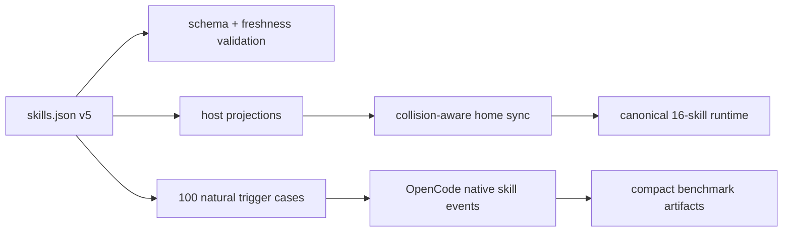

# 2026-07 Agent Skill Portfolio Audit

English | [繁體中文](2026-07-skill-portfolio-audit.zh-TW.md)

Status: implementation complete; free-model trigger acceptance failed
Scope: canonical `~/.agents/skills` portfolio and its Codex, Cursor, OpenCode, Claude, and Antigravity projections  
Decision date: 2026-07-11

## Executive decision

The portfolio remains useful, but only for capabilities that provide at least one of these advantages:

1. host- or tool-specific operation;
2. volatile domain knowledge that is easy to answer incorrectly;
3. a repeatable workflow with observable verification;
4. a boundary that prevents a high-cost routing mistake.

The active core therefore contracts from 19 to 16 skills. General planning, generic Bun scripting policy, and presentation production leave automatic discovery. The local meta-skill becomes `skill-portfolio-maintainer` so it no longer collides with Codex's system `skill-creator`.

Modern frontier models reduce the value of procedural scaffolding. OpenAI recommends leaner prompts and relying on stronger intent understanding; Anthropic warns that older, overly prescriptive skills can reduce quality. GLM and Grok also emphasize long-horizon agent execution. Skills still matter because Codex, Cursor, and OpenCode progressively discover them through compact name-and-description metadata. The portfolio should therefore keep routing and non-obvious constraints, not re-teach general software practice.

## Accepted target

- 16 active core skills.
- `skill-creator` renamed to `skill-portfolio-maintainer`.
- `brainstorming`, `bun-ts-scripting-policy`, and `ppt-generation` archived.
- Presentation-specific `image-generation` archived with `ppt-generation`.
- Native host planning and presentation capabilities take precedence.
- OpenCode trigger acceptance uses `opencode/nemotron-3-ultra-free`; `opencode/north-mini-code-free` covers boundary smoke.
- Home-level projection cleanup is allowed only through collision-aware backup-and-apply behavior.
- Implementation is delivered as seven independently validated commits.

## Model and host implications

| Surface | Design implication | Portfolio response |
| --- | --- | --- |
| GPT-5.6 / Codex | Strong intent inference; lean prompts; native planning, browsing, document, and presentation surfaces | Remove repeated scaffolding and do not intercept native capabilities |
| Claude Fable 5 | Over-prescriptive legacy skills can degrade output | Keep constraints and failure modes only; archive generic gates |
| GLM-5.2 | Long-running agentic execution with broad tool use | Prefer outcome checks over scripted answer formats |
| Grok 4.5 | High autonomy with less task specification | Test natural user prompts and actual tool events |
| Cursor | Native Agent Skills discovery | Project the canonical portfolio without a second content copy |
| OpenCode 1.17 | Native skill discovery and permissions; config precedence matters | Benchmark with isolated config and parse `skill` tool events |

## Runtime collision baseline

The pre-change runtime has four collision classes that must be handled without deleting unrelated personal configuration:

- Codex has a separate `react-component-designer` copy and a system `skill-creator` whose name collides with the local meta-skill.
- OpenCode has an older `java-pro` copy and archived skill shadows under `~/.config/opencode/skills`.
- Claude contains broken or backup links for older repo-owned skills.
- OpenCode's personal `opencode.json` is a real file with providers, credentials, plugins, and model choices; it must be merged, never replaced by a symlink.

Non-repo custom skills such as `hook-best-practices` and `user-global-rules` are explicitly out of scope.

## Acceptance architecture

Routing success is measured from the first actual `skill` tool event, never from a requested answer token such as `Selected:`. Outcome suites measure domain decisions, commands, artifacts, and safety boundaries. Raw transcripts and staged trees are disposable.

## Review cadence

- `fast`: 60 days for rapidly changing tool/API lanes.
- `release-driven`: 120 days for platform and framework release lanes.
- `stable`: 365 days for durable design and workflow boundaries.

An expired review is a validation failure. Official sources are required for version-sensitive skills.

## 2026-07 measured baseline

The implementation baseline is reproducible, but no tested free model met the routing acceptance gate. These results are evidence about native OpenCode skill discovery with the tested models; they are not a reason to restore archived skills or add more routing text without a new controlled experiment.

| Model and suite | First-skill / boundary | Wrong skill | Null precision | Timeout | Infra | Decision |
| --- | --- | --- | --- | --- | --- | --- |
| `opencode/deepseek-v4-flash-free`, Java retuned, 100 cases x 2 | 90.6% / 85.4% | 1.0% | 100.0% | 0.0% | 2 | Java and aggregate gates pass; portfolio still fails the frontend recall floor and has intermittent infra failures |
| `opencode/nemotron-3-ultra-free`, 100 cases x 2 | 14.1% / 14.6% | 6.0% | 100.0% | 33.5% | 1 | Fails trigger, boundary, wrong-skill, and timeout gates |
| `opencode/north-mini-code-free`, 24 boundary + 12 null x 2 | n/a / 58.3% | 1.4% | 100.0% | 0.0% | 3 | Fails boundary gate; free endpoint returned three infrastructure failures |

The 2026-07-11 targeted description tuning raised DeepSeek Flash macro recall from 82.0% to 86.7% and boundary accuracy from 81.3% to 85.4%. `skill-portfolio-maintainer` improved from 62.5% to 100%, and `spring-boot-engineer` from 62.5% to 87.5%. Two skills remained below the 75% positive-recall floor: `frontend-dev-guidelines` at 37.5% and `java-pro` at 62.5%. The two wrong-skill runs occurred at the existing Elysia/Drizzle and DDD/persistence boundaries; the earlier Spring Boot/OpenCode collision did not recur.

On 2026-07-17, `java-pro` was narrowed around supplied JVM evidence, selected virtual-thread migrations, and read-only JDK/API-status questions. Its same-day pre-change targeted baseline was 6/8 (75%); both post-change targeted passes were 8/8 (100%). The final full run also scored Java positives at 8/8 and the three Java-side boundary cases at 6/6. Portfolio macro accuracy reached 90.6%, boundary accuracy 85.4%, wrong-skill rate 1.0%, null precision 100%, and timeout rate 0%. The portfolio is not fully accepted because `frontend-dev-guidelines` remains at 62.5%, below the 75% per-skill floor.

The final run had two non-Java infrastructure failures. `teaching-pos-1` recovered at 2/2 on retry; `b19-maintainer` retried with one correct route and one repeated provider failure. No Java case had an infrastructure failure.

All 14 timeouts occurred in the final seven null cases after the free endpoint degraded. A post-run `ddd-pos-1` retry also timed out twice, confirming that the late failures crossed prompt categories. A third wording experiment was stopped under the same degraded service and reverted rather than committed without evidence. Raw retries are intentionally not retained.

The Nemotron run completed all 200 attempts. Its single explicit infrastructure-failure case, `persistence-pos-3`, was retried twice in isolation and timed out twice, reproducing free-endpoint degradation rather than producing a recoverable scored result. Representative North Mini misses were also retried before finalizing the baseline: `b05-elysia` again loaded no skill, while `b19-maintainer` timed out after description tuning. Raw retries are intentionally not retained.

Outcome fixtures remain at three or more concrete tasks per core skill, with synthetic `Selected:` assertions removed. A new free-model outcome pass was not promoted to an acceptance artifact because the tested models failed the prerequisite natural-trigger gate. Historical outcome runs remain evidence only. Further description expansion now risks keyword stacking without evidence; the next policy decision is whether to introduce an explicit host routing policy or retest on a stronger, stable endpoint. Silently lowering the agreed thresholds would invalidate this baseline.

## Primary references

- [OpenAI latest-model prompting](https://developers.openai.com/api/docs/guides/latest-model.md)
- [Claude Fable 5 prompting](https://platform.claude.com/docs/en/build-with-claude/prompt-engineering/prompting-claude-fable-5)
- [GLM-5.2](https://z.ai/blog/glm-5.2)
- [Grok 4.5](https://x.ai/news/grok-4-5)
- [Codex skills overview](https://learn.chatgpt.com/docs/customization/overview#skills)
- [Cursor Agent Skills](https://cursor.com/changelog/2-4)
- [OpenCode skills](https://dev.opencode.ai/docs/skills)

Historical audits and older model runs remain historical evidence; they are not the 2026-07 acceptance baseline.
