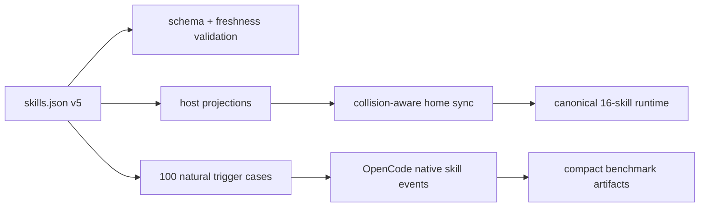

# 2026-07 Agent Skill Portfolio Audit

[English](2026-07-skill-portfolio-audit.md) | 繁體中文

狀態：實作完成；免費模型觸發驗收失敗

範圍：canonical `~/.agents/skills` portfolio，以及其 Codex、Cursor、OpenCode、Claude 與 Antigravity projections

決策日期：2026-07-11

## 執行決策

Portfolio 仍有價值，但只保留至少提供下列一項優勢的能力：

1. host 或工具專屬操作；
2. 容易回答錯誤、變化快速的 domain knowledge；
3. 具有可觀測驗證的可重複 workflow；
4. 能避免高成本 routing 錯誤的明確邊界。

因此 active core 從 19 個縮減為 16 個 skills。一般規劃、通用 Bun scripting policy 與簡報製作移出 automatic discovery。本地 meta-skill 改名為 `skill-portfolio-maintainer`，避免與 Codex system `skill-creator` 衝突。

現代 frontier models 降低了 procedural scaffolding 的價值。OpenAI 建議使用更精簡的 prompts，並依賴更強的 intent understanding；Anthropic 警告過度規範的舊 skills 可能降低品質。GLM 與 Grok 也強調 long-horizon agent execution。Skills 仍然重要，因為 Codex、Cursor 與 OpenCode 會透過精簡的 name-and-description metadata 逐步探索它們。因此 portfolio 應保留 routing 與非顯而易見的限制，而不是重新教授一般軟體實務。

## 已接受的目標

- 16 個 active core skills。
- `skill-creator` 改名為 `skill-portfolio-maintainer`。
- 封存 `brainstorming`、`bun-ts-scripting-policy` 與 `ppt-generation`。
- 簡報專用的 `image-generation` 隨 `ppt-generation` 一併封存。
- 優先使用 host 原生的規劃與簡報能力。
- OpenCode trigger acceptance 使用 `opencode/nemotron-3-ultra-free`；`opencode/north-mini-code-free` 負責 boundary smoke。
- Home-level projection cleanup 只能透過 collision-aware、先備份再套用的行為執行。
- 實作拆成七個可獨立驗證的 commits。

## 模型與 Host 的影響

| Surface | 設計影響 | Portfolio 回應 |
| --- | --- | --- |
| GPT-5.6 / Codex | 強大的 intent inference；精簡 prompts；原生 planning、browsing、document 與 presentation surfaces | 移除重複 scaffolding，不攔截原生能力 |
| Claude Fable 5 | 過度規範的 legacy skills 可能降低輸出品質 | 只保留 constraints 與 failure modes；封存通用 gates |
| GLM-5.2 | 使用廣泛工具的 long-running agentic execution | 優先驗證 outcomes，不使用 scripted answer formats |
| Grok 4.5 | 只需較少 task specification 即具備高度自主性 | 測試自然的使用者 prompts 與實際 tool events |
| Cursor | 原生 Agent Skills discovery | 投影 canonical portfolio，不建立第二份內容副本 |
| OpenCode 1.17 | 原生 skill discovery 與 permissions；config precedence 很重要 | 使用隔離 config 執行 benchmark，並解析 `skill` tool events |

## Runtime 衝突基準

異動前的 runtime 有四類衝突，處理時不可刪除不相關的個人設定：

- Codex 有另一份 `react-component-designer` copy，以及會與本地 meta-skill 同名衝突的 system `skill-creator`。
- OpenCode 有舊版 `java-pro` copy，且 `~/.config/opencode/skills` 下有 archived skill shadows。
- Claude 包含較舊、由 repository 管理之 skills 的 broken 或 backup links。
- OpenCode 的個人 `opencode.json` 是實體檔案，內含 providers、credentials、plugins 與 model choices；只能 merge，絕不能以 symlink 取代。

`hook-best-practices`、`user-global-rules` 等非 repository 自訂 skills 明確不在處理範圍內。

## 驗收架構

Routing success 以第一個實際 `skill` tool event 衡量，不使用 `Selected:` 等指定答案 token。Outcome suites 衡量 domain decisions、commands、artifacts 與 safety boundaries。Raw transcripts 與 staged trees 都是可丟棄資料。

## 複查週期

- `fast`：快速變動的工具／API lanes 每 60 天複查。
- `release-driven`：platform 與 framework release lanes 每 120 天複查。
- `stable`：長期穩定的設計與 workflow boundaries 每 365 天複查。

逾期未複查會造成 validation failure。Version-sensitive skills 必須提供官方來源。

## 2026-07 實測基準

實作基準可重現，但所有測試過的免費模型都未通過 routing acceptance gate。這些結果反映測試模型在 OpenCode 原生 skill discovery 上的表現；不應因此恢復 archived skills，或在沒有新 controlled experiment 的情況下加入更多 routing text。

| 模型與測試套件 | First-skill / boundary | Wrong skill | Null precision | Timeout | Infra | 決策 |
| --- | --- | --- | --- | --- | --- | --- |
| `opencode/deepseek-v4-flash-free`，Java retuned，100 cases x 2 | 90.6% / 85.4% | 1.0% | 100.0% | 0.0% | 2 | Java 與 aggregate gates 通過；portfolio 仍未通過 frontend recall floor，且有間歇性 infra failures |
| `opencode/nemotron-3-ultra-free`，100 cases x 2 | 14.1% / 14.6% | 6.0% | 100.0% | 33.5% | 1 | 未通過 trigger、boundary、wrong-skill 與 timeout gates |
| `opencode/north-mini-code-free`，24 boundary + 12 null x 2 | n/a / 58.3% | 1.4% | 100.0% | 0.0% | 3 | 未通過 boundary gate；免費 endpoint 回傳三次 infrastructure failures |

2026-07-11 的針對性 description tuning，將 DeepSeek Flash macro recall 從 82.0% 提升至 86.7%，boundary accuracy 從 81.3% 提升至 85.4%。`skill-portfolio-maintainer` 從 62.5% 提升至 100%，`spring-boot-engineer` 從 62.5% 提升至 87.5%。仍有兩個 skills 低於 75% positive-recall floor：`frontend-dev-guidelines` 為 37.5%，`java-pro` 為 62.5%。兩次 wrong-skill runs 發生在既有 Elysia/Drizzle 與 DDD/persistence 邊界；較早的 Spring Boot/OpenCode 衝突沒有再次發生。

2026-07-17，`java-pro` 的範圍收斂至已提供的 JVM evidence、已選定的 virtual-thread migrations，以及唯讀 JDK/API-status 問題。同日異動前的 targeted baseline 為 6/8（75%）；異動後兩次 targeted passes 都是 8/8（100%）。最終完整測試的 Java positives 為 8/8，三個 Java-side boundary cases 為 6/6。Portfolio macro accuracy 達 90.6%，boundary accuracy 為 85.4%，wrong-skill rate 為 1.0%，null precision 為 100%，timeout rate 為 0%。Portfolio 尚未完全通過驗收，因為 `frontend-dev-guidelines` 仍為 62.5%，低於每個 skill 的 75% floor。

最終測試有兩次非 Java infrastructure failures。`teaching-pos-1` 重試後恢復為 2/2；`b19-maintainer` 重試時一次 routing 正確，另一次 provider failure 再次發生。Java cases 都沒有 infrastructure failure。

免費 endpoint 劣化後，最後七個 null cases 共發生 14 次 timeouts。測試後重試 `ddd-pos-1` 也連續兩次 timeout，確認後段失敗橫跨不同 prompt categories。第三次 wording experiment 在相同 degraded service 下停止，並還原變更，避免提交未經證據支持的修改。Raw retries 刻意不保留。

Nemotron 測試完成全部 200 次 attempts。唯一明確的 infrastructure-failure case `persistence-pos-3` 經兩次獨立重試仍 timeout，重現免費 endpoint degradation，而不是產生可恢復的評分結果。North Mini 的代表性 misses 也在確立最終基準前重試：`b05-elysia` 再次沒有載入 skill，`b19-maintainer` 則在 description tuning 後 timeout。Raw retries 刻意不保留。

每個 core skill 仍保有至少三個具體 task 的 outcome fixtures，並已移除 synthetic `Selected:` assertions。新的免費模型 outcome pass 沒有提升為 acceptance artifact，因為測試模型都未通過先決的 natural-trigger gate。歷史 outcome runs 僅作為證據。繼續擴張 description 會有 keyword stacking 的風險，且沒有證據支持；下一個 policy decision 應是導入明確的 host routing policy，或在更強且穩定的 endpoint 上重新測試。若暗中降低既定 thresholds，這份 baseline 將失效。

## 主要參考來源

- [OpenAI latest-model prompting](https://developers.openai.com/api/docs/guides/latest-model.md)
- [Claude Fable 5 prompting](https://platform.claude.com/docs/en/build-with-claude/prompt-engineering/prompting-claude-fable-5)
- [GLM-5.2](https://z.ai/blog/glm-5.2)
- [Grok 4.5](https://x.ai/news/grok-4-5)
- [Codex skills overview](https://learn.chatgpt.com/docs/customization/overview#skills)
- [Cursor Agent Skills](https://cursor.com/changelog/2-4)
- [OpenCode skills](https://dev.opencode.ai/docs/skills)

歷史 audits 與較舊的 model runs 仍是歷史證據，不是 2026-07 acceptance baseline。
